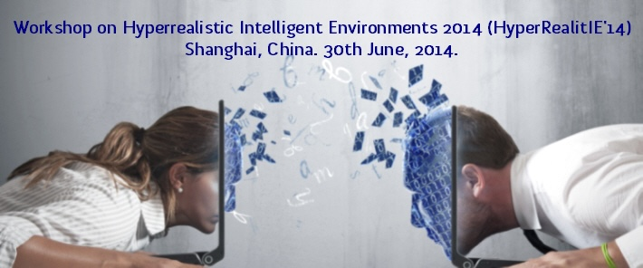

## HyperRealitIE '14
Workshop on Hyperrealistic Intelligent Environments 2014  
30th June. Shanghai, China

# CfP 2014
{:height="296" width="900"}

# Background
Hyperreality tries to achieve a vision in which virtuality and reality are seamlessly blended as if they were one, with no distinction on where one ends and the other begins; blending physical reality with virtual reality and human intelligence with artificial intelligence [1].

Virtual and augmented reality are used daily as standalone applications in areas such as computer gaming and mobile devices. Companies such as Google, Nokia and Microsoft are investing in and developing technology and interfaces to connect the virtual and real worlds...

[1] “Hyperreality : Paradigm for the third millennium”. Tiffin, John; Nobuyoshi Terashima (2005).

# Areas of interest
The proposed workshop aims to explore the integration between physical and virtual worlds in intelligent environments, augmenting their capacities to create innovative spaces. Examples of relevant areas of interest include:

- Ubiquitous Virtual Reality
- Augmented Reality
- Augmented Virtuality
- Artificial Intelligence
- Tangible user interfaces
- Cyber-physical systems
- Multidimensional spaces
- Multi-user and distributed systems
- Immersive environments
- Interactive Intelligent Environments
- Web technology for hyperreality
- Mobile applications for hyperreality
- Computer Games & Intelligent Environments
- Context-aware computing in virtual/real spaces
- Blended / Dual / Cross Reality
- Smart objects in multidimensional spaces
- Multimodal HCI for interaction and feedback
- Real-time behaviour analysis
- Agent-based approaches to AmI in multidimensional spaces
- Proof-of-concept and demonstration deployments
- Responsive / Active architecture
- Applications, user evaluation and social studies
- Security and privacy issues
- Perception, presence, and cognition
- Social issues and impact

# Format of Submissions
HyperRealitIE’14 welcomes original work as full papers (10-12 pages), short papers (4-6 pages), and work-in-progress or position papers.

# Important Dates
- **Paper submission deadline:** 4th April 2014
- **Notification of acceptance:** ~~25th April 2014~~ 5th May 2014
- **Final manuscript due:** ~~6th May 2014~~ 8th May 2014
- **Workshop date:** 30th June

# Organisers
[Victor Callaghan](http://victor.callaghan.info/) (University of Essex)  
[Anasol Pena-Rios](http://prlosana.com/) (University of Essex)  
Marc Davies (University of Essex)  
[Carlos Sanchez-Lozano](http://www.jcsanchezlozano.com/) (HapticMind)  
Malek Alrashidi (University of Essex)

# Programme
### [Download Programme (pdf version)](/images/2014_HR14(Preface).pdf)